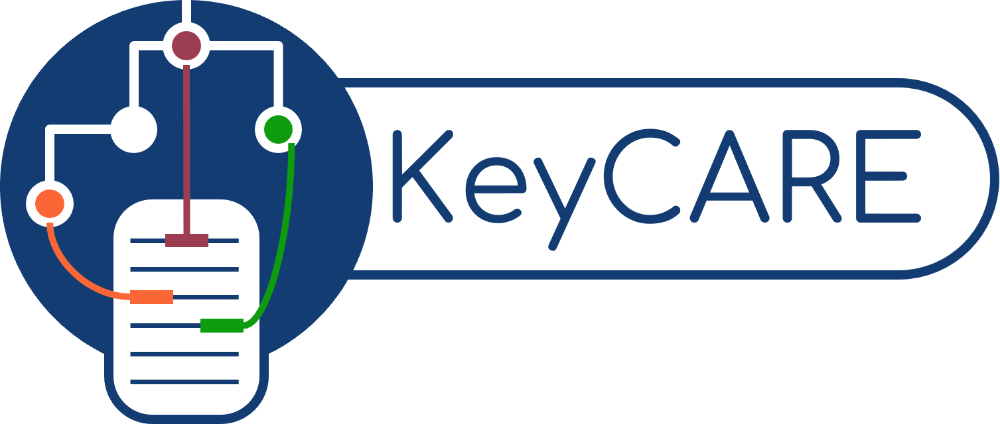

<!--
*** Thanks for checking out the Best-README-Template. If you have a suggestion
*** that would make this better, please fork the repo and create a pull request
*** or simply open an issue with the tag "enhancement".
*** Thanks again! Now go create something AMAZING! :D
-->
<!-- PROJECT SHIELDS -->
<!--
*** I'm using markdown "reference style" links for readability.
*** Reference links are enclosed in brackets [ ] instead of parentheses ( ).
*** See the bottom of this document for the declaration of the reference variables
*** for contributors-url, forks-url, etc. This is an optional, concise syntax you may use.
*** https://www.markdownguide.org/basic-syntax/#reference-style-links
-->
<!--
#
[![Contributors][contributors-shield]][contributors-url]
[![Forks][forks-shield]][forks-url]
[![Stargazers][stars-shield]][stars-url]
[![Issues][issues-shield]][issues-url]
[![MIT License][license-shield]][license-url]
[![LinkedIn][linkedin-shield]][linkedin-url]
-->
<!-- PROJECT LOGO -->
# KeyCARE 

A framework for biomedical Keyword Extraction, term Categorization, and semantic Relation.

<p align="left">
    <br />
    <a href="https://github.com/nlp4bia-bsc/keycare"><strong>Explore the docs »</strong></a>
</p>
<p align="center">
    <a href="https://github.com/nlp4bia-bsc/keycare/issues">Report Bug</a>
    ·
    <a href="https://github.com/nlp4bia-bsc/keycare/issues">Request Feature</a>
</p>

<!-- TABLE OF CONTENTS -->
<a name="toc"/></a>
## Table of Contents  
   1. [About the Project](#about)  
   2. [Getting Started](#gettingstarted)  
        2.1. [Installation](#installation)  
        2.2. [Usage](#usage)  
   3. [Contributing](#contributing)  
   4. [License](#license)
   5. [References](#references)

<!-- ABOUT THE PROJECT -->

<a name="about"/></a>
## 1. About The Project
[Back to ToC](#toc)

KeyBERT provides a common interface for extracting, categorizing and associating terms extracted from a text: 

1. **Keywords extraction**: KeyCARE implements several unsupervised term extraction techniques such as [*YAKE*](https://github.com/LIAAD/yake), [*RAKE*](https://pypi.org/project/rake-nltk/), [*TextRank*](https://pypi.org/project/pytextrank/) or [*KeyBERT*](https://github.com/MaartenGr/KeyBERT) to automatically extract key terms from a text.
2. **Term categorization**: KeyCARE allows the application of term clustering techniques to group similar terms, as well as the training and application of supervised techniques to classify keywords into predefined categories, including [SetFit](https://github.com/huggingface/setfit). 
3. **Semantic relation classification**: Beyond the identification and categorization of terms, the library supports the use of neural classification models, such as the [Transformer's AutoModelForSequenceClassification](https://github.com/huggingface/transformers), to extract the semantic relation between two terms by means of EXACT, BROAD, NARROW and NO_RELATION relationships, which allows interconnecting the extracted terms and can be used for terminological enrichment, among other tasks.

<!-- GETTING STARTED -->
<a name="gettingstarted"/></a>
## 2. Getting Started
[Back to ToC](#toc)

<a name="installation"/></a>
### 2.1. Installation 
Installation can be done using pypi:

```sh
   pip install keycare
```

You might also need to install spacy's es_core_news_sm:

```sh
   python3 -m spacy download es_core_news_sm
```

<a name="usage"/></a>
### 2.2. Usage 
The library is built on 3 main processes: keyword extraction, term categorization and relations extraction. The two first processes have been implemented within a same pipeline in the class `TermExtractor`, which automatically extracts classified keywords frim pieces of text. The relations extraction process among term pairs or groups of terms is implemented in the other main class, `RelExtractor`.

#### TermExtractor
For the use of TermExtractor with default parameters, use the following code:

```sh
   from keycare.TermExtractor import TermExtractor
   extractor = TermExtractor()
   extractor("...") # Introduce your text here
   extractor.keywords
```

This code calls TermExtractor with default parameters on a piece of text and returns the extracted keywords with their assigned class.

#### RelExtractor
For the use of RelExtractor with default parameters, use the following code:

```sh
   from keycare.RelExtractor import RelExtractor
   relextractor = RelExtractor()
   relextractor("...", "...") # Introduce your term pairs here
   relextractor.relations
```

This code calls RelExtractor with default parameters on pairs of terms and returns the existing relation among them.

For further information on the functioning of the library and the available parameters refer to the tutorials in the nbs folder.

<!-- CONTRIBUTING -->
<a name="contributing"/></a>
## 3. Contributing
[Back to ToC](#toc)

This library has been developed with Python 3.10.12

Any contributions you make are **greatly appreciated**. For contributing:

1. Fork/Clone the Project in your system
   ```sh
   git clone https://github.com/nlp4bia-bsc/keycare.git
   ```
2. Create a new virtual environment

   ```sh
   python3 -m venv .env_keycare
   ```
3. Activate the new environment

   ```sh
   source .env_keycare/bin/activate
   ```
4. Install the requirements

    ```sh
    pip install -r requirements.txt
    ```
5. Create your Feature Branch (`git checkout -b feature/AmazingFeature`)
6. Update requirements file (`pip freeze > requirements.txt`)
7. Commit your Changes (`git commit -m 'Add some AmazingFeature'`)
8. Push to the Branch (`git push origin feature/AmazingFeature`)
9. Open a Pull Request from github.

Follow [this tutorial](https://github.com/Kunena/Kunena-Forum/wiki/Create-a-new-branch-with-git-and-manage-branches) to create a branch.

<!-- LICENSE -->
<a name="license"/></a>
## 4. License
[Back to ToC](#toc)

[Apache License, Version 2.0](https://www.apache.org/licenses/LICENSE-2.0)

<a name="references"/></a>
## 5. References
[Back to ToC](#toc)

A paper on the library will soon be published. Please cite if you use the library in scientific works.
